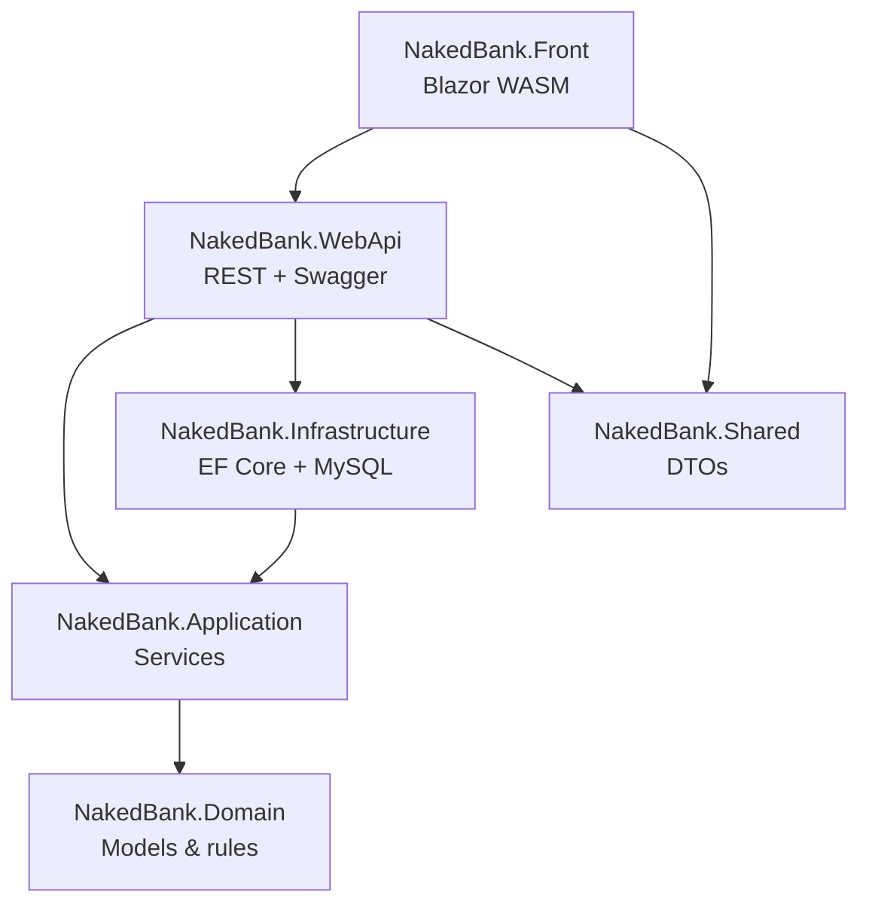

# Nakedbank

A full-stack banking sample application built with clean architecture on **.NET 10**.  
The name is a [silly joke](https://web.archive.org/web/20250209214501/https://blog.nubank.com.br/por-que-nubank-chama-nubank/) about a certain purple Brazilian bank.

---

## At a glance

| | |
|---|---|
| **Backend** | ASP.NET Core REST API, JWT auth, Swagger, Coravel scheduler |
| **Frontend** | Blazor WebAssembly SPA |
| **Data** | Entity Framework Core + MySQL |
| **Tests** | xUnit + NSubstitute (domain & application layers) |
| **Deploy** | Docker Compose under `deploy/` |

SDK version is pinned in [`global.json`](global.json) (`10.0.301`).

---

## What works today

- **Layered architecture** — Domain, Application, Infrastructure, Shared, WebApi, Front
- **User authentication** — JWT issued on login; protected profile and account endpoints
- **Account operations** — view balances and transactions; deposit, withdraw, and pay bills
- **Scheduled interest** — Coravel job updates account balances on a timer
- **Database seeding** — DEBUG builds recreate and seed a demo database on startup
- **API documentation** — Swagger UI at `/swagger`
- **Secrets hygiene** — no production credentials in source control; local setup via `.env`, User Secrets, or `appsettings.Development.json` (see [Configuration](#configuration))
- **Unit tests** — 19 tests across domain and application projects

---

## Architecture



| Project | Role |
|---------|------|
| `NakedBank.Domain` | Entities, value objects, domain exceptions |
| `NakedBank.Application` | Business services and repository interfaces |
| `NakedBank.Infrastructure` | `DbContext`, repositories, DEBUG seeding |
| `NakedBank.Shared` | Request/response DTOs shared by API and Front |
| `NakedBank.WebApi` | **Primary** REST API |
| `NakedBank.Front` | Blazor WebAssembly UI |
| `NakedBank.Api` | gRPC service — **experimental**, not production-ready |
| `NakedBank.*.Tests` | Unit tests |

---

## API

| Method | Route | Auth | Description |
|--------|-------|------|-------------|
| `POST` | `/api/users/authenticate` | — | Login, returns JWT |
| `GET` | `/api/users/profile` | JWT | Current user profile |
| `GET` | `/api/users/accounts` | JWT | User accounts |
| `GET` | `/api/accounts/{id}/balances` | JWT | Balance history |
| `GET` | `/api/accounts/{id}/transactions` | JWT | Recent transactions |
| `POST` | `/api/accounts/{id}/transactions` | JWT | Deposit, withdraw, or payment |

---

## Prerequisites

- [.NET 10 SDK](https://dotnet.microsoft.com/download) (see `global.json`)
- [Docker Desktop](https://www.docker.com/products/docker-desktop/) — optional, recommended for the backend stack
- Local MySQL — only if running WebApi outside Docker

---

## Quick start

### Docker Compose (backend)

```bash
cd deploy
cp .env.example .env
# Edit .env, then:
docker compose up --build
```

| Service | Port | Purpose |
|---------|------|---------|
| MySQL | `3306` | `NakedDatabase` |
| Adminer | `8080` | Database admin UI |
| `nakedbank.webapi` | dynamic | REST API — run `docker compose ps` for the mapped port |
| `nakedbank.api` | `8080` / `8081` | gRPC (experimental) |

The Blazor frontend is **not** in Compose yet. Run it locally (below) and set `apiUrl` to the WebApi address.

> On macOS/Linux, `deploy/docker-compose.override.yml` uses Windows `%APPDATA%` volume mounts. Prefer `.env` variables or run WebApi with `dotnet run`.

### Local WebApi + Front

**1. Configuration** — see [Configuration](#configuration) below.

**2. API**

```bash
dotnet run --project src/NakedBank.WebApi
```

Swagger: `https://localhost:5001/swagger`

**3. Frontend**

Set `apiUrl` in `src/NakedBank.Front/wwwroot/appsettings.json`:

```json
{
    "apiUrl": "https://localhost:5001/api/"
}
```

```bash
dotnet run --project src/NakedBank.Front
```

### Demo account (DEBUG seed)

| Field | Value |
|-------|-------|
| Username | `12345678900` |
| Password | `NakedDemoPass123` |

> **Note:** Password verification uses a legacy hash format. If login fails against a seeded database, check that seed data and the `Password` value object use the same hashing algorithm.

---

## Configuration

Committed config uses placeholders. Provide secrets locally using **one** of:

**Docker** — copy and edit `deploy/.env.example` → `deploy/.env`

**Development file**

```bash
cp src/NakedBank.WebApi/appsettings.Development.json.example \
   src/NakedBank.WebApi/appsettings.Development.json
```

**User Secrets**

```bash
dotnet user-secrets set "AuthSettings:Secret" "YOUR_JWT_SIGNING_SECRET" \
  --project src/NakedBank.WebApi
dotnet user-secrets set "MySqlConfig:ConnectionString" \
  "Server=localhost;Database=NakedDatabase;Uid=root;Pwd=YOUR_PASSWORD;" \
  --project src/NakedBank.WebApi
```

**Environment variables** (override appsettings):

| Variable | Purpose |
|----------|---------|
| `AuthSettings__Secret` | JWT signing key |
| `MySqlConfig__ConnectionString` | MySQL connection |

---

## Build & test

```bash
dotnet build NakedBank.sln
dotnet test
```

Individual projects:

```bash
dotnet test tests/NakedBank.Domain.Tests
dotnet test tests/NakedBank.Application.Tests
```

---

## Known limitations & future work

- gRPC `NakedBank.Api` is included in Compose but incomplete (no DI wiring, stub handlers)
- Schema managed via `EnsureCreated` + seed — EF Core migrations not in place yet
- CORS allows any origin; `AllowedHosts` is `localhost` only
- Password hashing should move to a modern hasher with per-user salts
- Docker Compose override paths are Windows-oriented; cross-platform fixes pending
- Blazor frontend is not containerized in Compose
- Login page still displays demo credentials in the UI during development
- Blazor WASM auth and route-guard edge cases remain
- Charts and richer dashboards need a frontend stack upgrade (current WASM setup limits chart library options)
- Planned features: token refresh, transfers, user profile page, idempotency for financial POSTs
- Code quality: parametrize remaining magic strings; push more business rules into the domain layer

---

## Third-party libraries

- [AutoMapper](https://automapper.org/) — mapping
- [Coravel](https://docs.coravel.net/) — scheduling
- [Swashbuckle](https://github.com/domaindrivendev/Swashbuckle.AspNetCore) — OpenAPI / Swagger
- [xUnit](https://xunit.net/) + [NSubstitute](https://nsubstitute.github.io/) — testing

The SPA auth flow started from [Jason Watmore's Blazor JWT example](https://github.com/cornflourblue/blazor-webassembly-jwt-authentication-example).